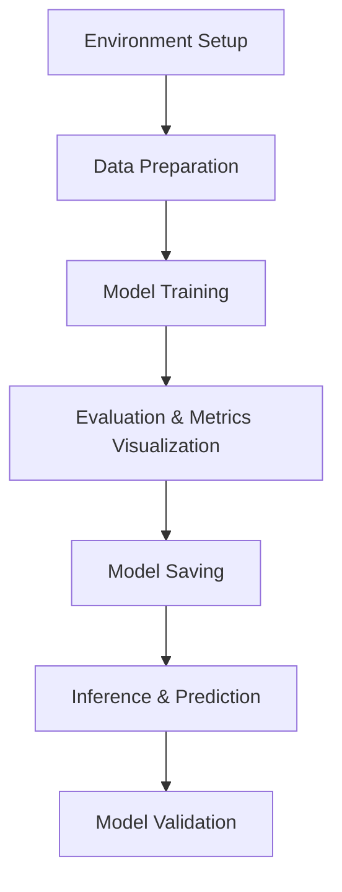

# Face Detection with YOLOv8 (Fine-Tuned)

This project leverages the YOLOv8 object detection architecture, fine-tuned specifically for face detection tasks.  
Trained on a publicly available image dataset, the model can accurately **detect and draw bounding boxes** around faces in both single and multiple images.
Developed using Python and the Ultralytics YOLOv8 framework, this solution provides a fast, efficient, and lightweight approach to face detection in images.

## Project Overview

This project focuses on face detection using a fine-tuned YOLOv8 model. It takes images as input and accurately identifies faces by drawing bounding boxes around them. The model is trained on a publicly available dataset, making it reliable and efficient for detecting faces in both individual images and batches of images.

**Key features include:**

- Training (Fine-tuning) a state-of-the-art object detection model (YOLOv8) for face detection  
- Support for single or multiple image inputs  
- Fast and accurate bounding box predictions around faces  
- Easy integration with Python scripts for inference  

The project is designed for image analysis tasks that require robust face localization without real-time video processing.

## High End Architecture


## Project Architecture

The Face Detection project follows a structured pipeline leveraging the YOLOv8 model and Google Colab GPU for efficient training and inference:

1. **Environment Setup**  
   - Check GPU availability using `nvidia-smi`  
   - Install required libraries like `ultralytics` for YOLOv8  
   - Mount Google Drive to access dataset and save results  

2. **Data Preparation**  
   - Load and visualize sample training images using OpenCV  
   - Prepare the dataset YAML file specifying training and validation image paths, number of classes, and class names  

3. **Model Training**  
   - Fine-tune the pre-trained YOLOv8n model with the prepared dataset  
   - Configure training parameters such as epochs, batch size, image size, caching, and worker threads  
   - Monitor training progress through logs and loss curves  

4. **Evaluation and Metrics Visualization**  
   - Load training results from CSV files  
   - Plot key metrics: box loss, precision, recall, and mean Average Precision (mAP) across epochs  
   - Validate model performance on the validation dataset  

5. **Model Saving**  
   - Copy the best trained weights (`best.pt`) from the local run directory to Google Drive for later use

6. **Inference and Prediction**  
   - Load the saved model weights for inference  
   - Predict on single or multiple validation images, drawing bounding boxes around detected faces  
   - Display predictions using Matplotlib and OpenCV  
   - Save predicted output images back to Google Drive  

7. **Model Validation**  
   - Run a comprehensive validation using the YOLOv8 `val()` method to report final metrics on the dataset


 ## 📁 Dataset Structure 
```
/dataset
├── images
│   ├── train
│   └── val
├── labels
│   ├── train
│   └── val
└── data.yaml
```

Download Dataset using the link - https://www.kaggle.com/datasets/fareselmenshawii/face-detection-dataset


## 🚀 How to Run the Project

You can build your own model using following steps and get the output-
### ✅ 1. Open the Colab Notebook
Open the notebook by downloading it through the link below and upload it to your own Google Drive.
https://github.com/dhanya807/Face_Detection/blob/main/Face_Detection.ipynb

📓 **Notebook Name:** `Face_Detection.ipynb`  
📍 Make sure it's in your Google Drive if you're opening from there.

---
### ✅ 2. Google Drive Setup
Make sure your dataset and model save paths point to valid folders in your Drive.  
The notebook includes code to:

- Mount Google Drive  
- Access dataset from: `/content/drive/MyDrive/your-dataset-folder/`  
- Save model weights and output predictions back to Drive  
---

### ✅ 3. Requirements
Colab will auto-install dependencies, but here are key packages:

- `ultralytics` – YOLOv8 training and inference  
- `opencv-python` – image loading and visualization  
- `matplotlib` – plotting metrics  

These are installed in the notebook itself, so no local installation is needed.

---
### ✅ 4. Run the Notebook Step-by-Step
- Go to [Google Colab](https://colab.research.google.com/)
- Click **File > Open Notebook**
- Choose the uploaded `.ipynb` file.
- Download the dataset and upload it your drive.
- Change the path to your drive path containing the dataset.
- Click **Runtime > Run all** to execute all cells from top to bottom, or run manually step by step.
---

### ✅ 5. Output
- 📦 Trained model saved as: `best.pt`  
- 🖼️ Predictions saved with bounding boxes in the `runs/predict/` directory  
- 📊 Evaluation metrics printed and visualized at the end


---

## Using a Pretrained Model for Inference

If you wish to use a pre-trained model directly for inference without retraining:

1.  **Obtain the Pretrained Model:** Download the `face_yolov8n_best.pt` file from source(https://github.com/dhanya807/Face_Detection/blob/main/face_yolov8n_best.pt).             
    This file should be placed in a location accessible by your notebook (e.g., your Google Drive if using Colab, or a local `weights/` folder).

2.  **Open the Inference Notebook:** Open the notebook designed for inference (e.g., `Face_Detection_modelcheck.ipynb`).

    * **If cloned locally:** `jupyter notebook Face_Detection_modelcheck.ipynb`

    * **If using Google Colab:** Upload it to your Drive and open from there.

3.  **Update Paths:**

    * **Replace the trained model path** in the notebook to point to the exact location of `face_yolov8n_best.pt` in your Drive or local file system.

    * **Replace the prediction image path** to your desired input image path.

4.  **Run Inference:** Click **Runtime > Run all** to execute the inference cells.


